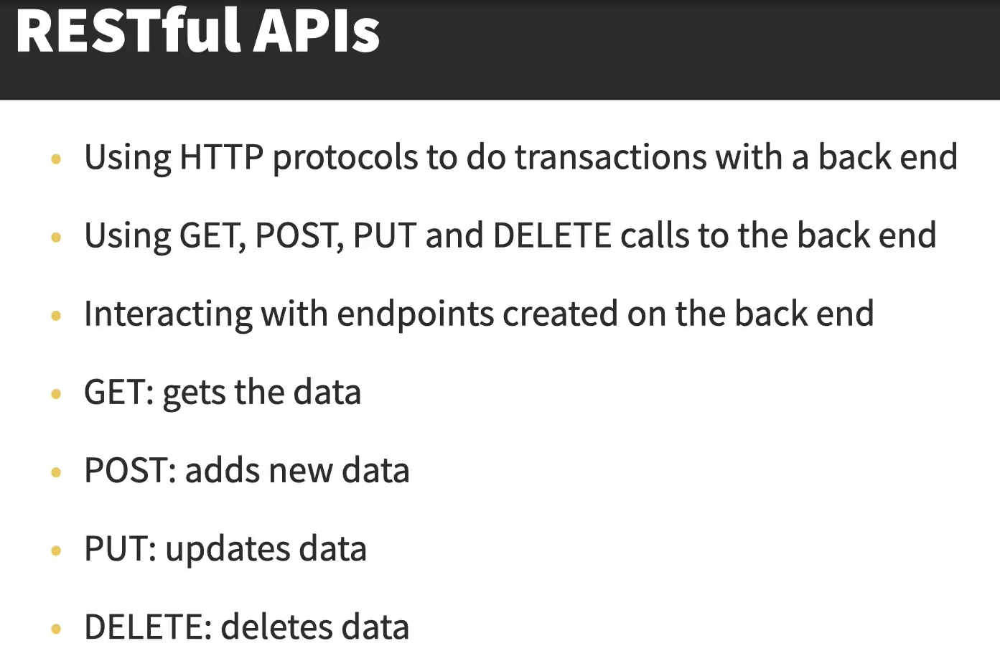
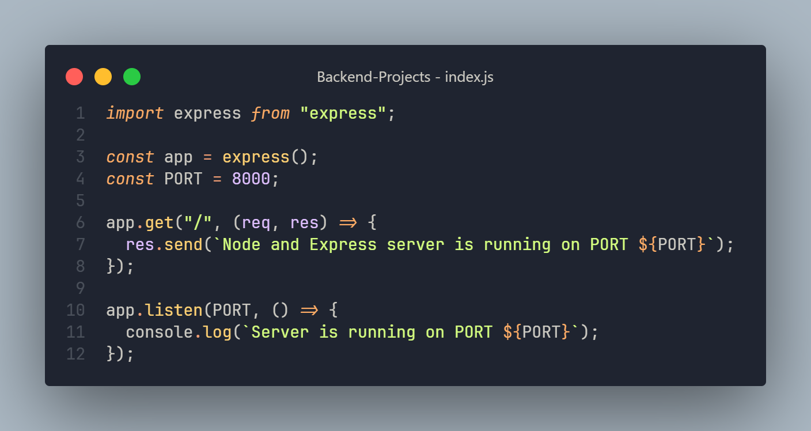
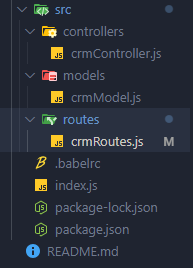
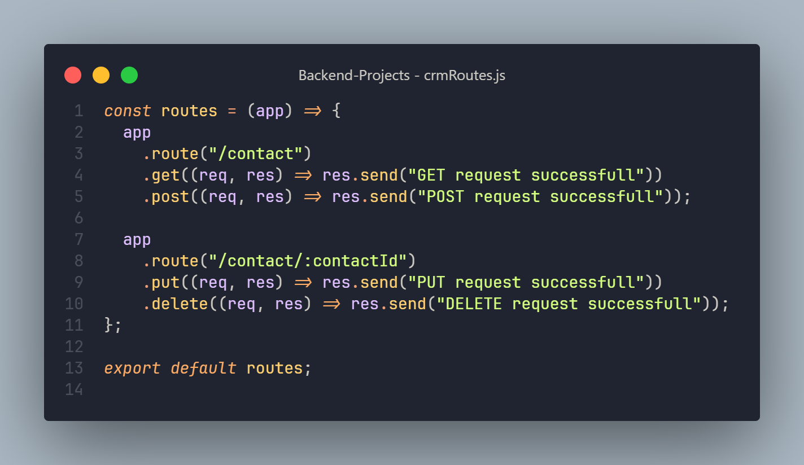
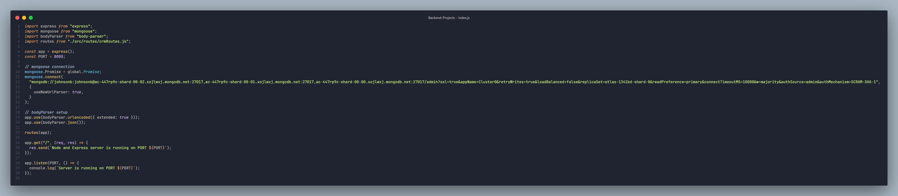
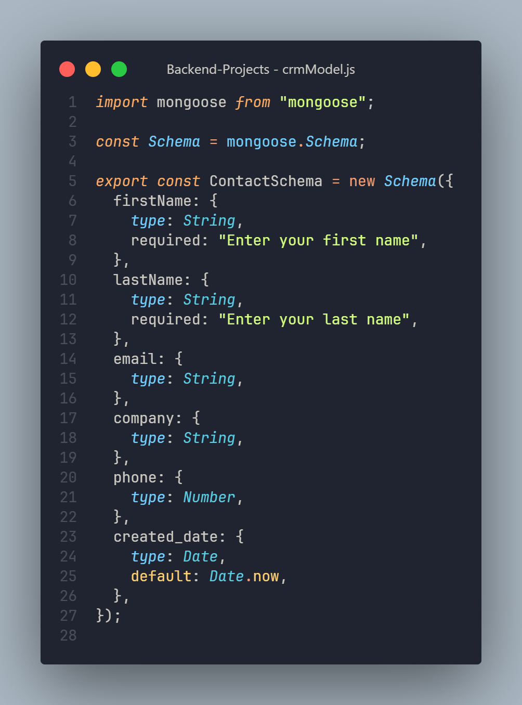

# RESTful and API

## Express server initial setup

Controllers:

- are the functions that allow us to get information into the endpoints and forward it to whoever is calling it.

Routes:

- are basically the endpoints

Models:

- are the schema models for out database

## Folder Structure

`crmRoutes.js`

## Middlewares

- are simply functions that have access to the request and response object
- In express application It can run code there
- It can make changes to the request response objects

## Mongo DB setup

- create new DB with cluster or localhost:27017
- connect with mongoose and body-parser

## Mongo DB schema

- dictates the types of data and the structure of your data for the DB

## Controller

- send the data to the database
- update the data to the database

`const Contact = mongoose.model("Contact", ContactSchema);`
